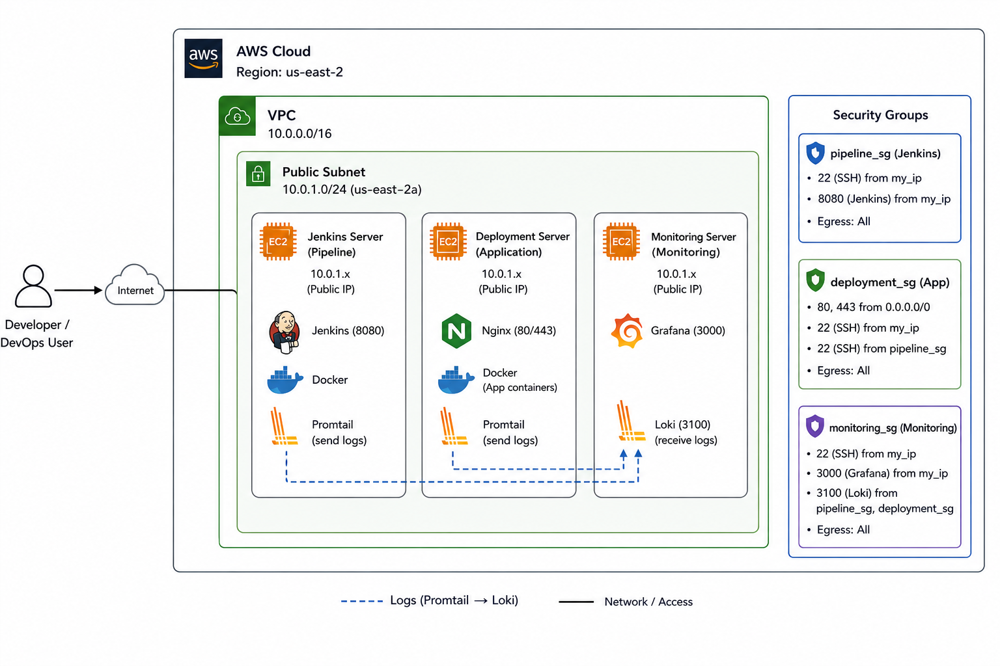
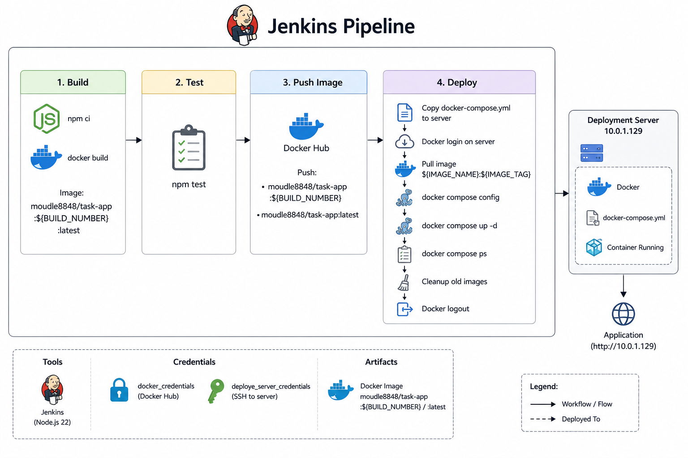

# Task App — AWS DevOps Deployment

A simple full-stack application deployed on AWS using **Terraform, Jenkins, Docker, and Nginx**.

The project demonstrates:

- Infrastructure provisioning with Terraform
- AWS VPC and EC2 setup
- Jenkins CI/CD pipeline
- Docker image building
- Docker Hub image publishing
- Automated deployment to an EC2 server
- Nginx for application access
- Separate deployment and Jenkins servers

---

## Architecture

The infrastructure is created using Terraform on AWS.

### AWS Infrastructure

- **AWS Region:** `us-east-2`
- **VPC:** `10.0.0.0/16`
- **Public Subnet:** `10.0.1.0/24`
- **Availability Zone:** `us-east-2a`
- **Internet Gateway:** Provides internet access
- **Route Table:** Routes internet traffic through the Internet Gateway
- **3 EC2 Instances:**
  - Jenkins Server
  - Deployment Server
  - Monitoring Server

### Architecture Diagram



---

## Servers

| Server            | Purpose            | Main Services   |
| ----------------- | ------------------ | --------------- |
| Jenkins Server    | CI/CD              | Jenkins, Docker |
| Deployment Server | Run application    | Docker, Nginx   |
| Monitoring Server | Monitoring/logging | Grafana, Loki   |

---

## 1. Jenkins Server

The Jenkins server is responsible for running the CI/CD pipeline.

### Services

- Jenkins
- Node.js 22
- Docker

Jenkins performs the following tasks:

```text
Build
  ↓
Test
  ↓
Push Docker Image
  ↓
Deploy Application
```

Jenkins is accessible on:

```text
http://<JENKINS_PUBLIC_IP>:8080
```

SSH access:

```text
ssh -i my-ec2-key.pem ubuntu@<JENKINS_PUBLIC_IP>
```

---

## 2. Deployment Server

The deployment server runs the actual application.

### Services

- Docker
- Docker Compose
- Nginx
- Task App container

Application deployment directory:

```text
/opt/task-app
```

The application is exposed through:

```text
HTTP :80
HTTPS :443
```

The Jenkins server connects to this server using SSH and performs the deployment automatically.

---

## 3. Monitoring Server

The monitoring server is used for application and infrastructure logging.

### Services

- Grafana
- Loki

Grafana:

```text
http://<MONITORING_PUBLIC_IP>:3000
```

Loki:

```text
http://<MONITORING_PRIVATE_IP>:3100
```

Promtail can send logs from the Jenkins and deployment servers to Loki.

---

# Terraform

Terraform is used to create the complete AWS infrastructure.

## Terraform Resources

The configuration creates:

```text
AWS
│
├── VPC
│   └── 10.0.0.0/16
│
├── Public Subnet
│   └── 10.0.1.0/24
│
├── Internet Gateway
│
├── Route Table
│
├── Security Groups
│   ├── Jenkins
│   ├── Deployment
│   └── Monitoring
│
├── EC2
│   ├── Jenkins Server
│   ├── Deployment Server
│   └── Monitoring Server
│
└── SSH Key Pair
```

---

## Terraform Providers

The project uses:

- AWS provider
- TLS provider
- Local provider

The TLS provider generates an RSA SSH key.

The public key is uploaded to AWS and the private key is saved locally as:

```text
my-ec2-key.pem
```

---

## Terraform Directory Structure

Recommended structure:

```text
project/
│
├── task-app/
│   ├── Dockerfile
│   ├── docker-compose.yml
│   ├── package.json
│   └── ...
│
├── terraform/
│   ├── main.tf
│   ├── variables.tf
│   ├── outputs.tf
│   ├── providers.tf
│   │
│   └── user-data/
│       ├── jenkins_userdata.sh
│       ├── deployment_userdata.sh
│       └── monitoring_userdata.sh
│
├── Jenkinsfile
└── README.md
```

---

# Security Groups

Three security groups are used.

## Jenkins Security Group

Allows:

```text
22    SSH       → my_ip
8080  Jenkins   → my_ip
```

All outbound traffic is allowed.

---

## Deployment Security Group

Allows:

```text
80    HTTP      → Internet
443   HTTPS     → Internet
22    SSH       → my_ip
22    SSH       → Jenkins security group
```

All outbound traffic is allowed.

---

## Monitoring Security Group

Allows:

```text
22    SSH       → my_ip
3000  Grafana   → my_ip
3100  Loki      → Jenkins + Deployment servers
```

All outbound traffic is allowed.

---

# Jenkins CI/CD Pipeline

The Jenkinsfile contains four main stages:

```text
┌─────────┐
│  Build  │
└────┬────┘
     ↓
┌─────────┐
│  Test   │
└────┬────┘
     ↓
┌──────────────┐
│ Push Image   │
└────┬─────────┘
     ↓
┌──────────────┐
│    Deploy    │
└────┬─────────┘
     ↓
Deployment Server
```

### Jenkins Pipeline Diagram



---

# Pipeline Configuration

The pipeline uses:

```text
Node.js 22
```

Docker image:

```text
moudle8848/task-app
```

The image tag is generated from the Jenkins build number:

```text
${BUILD_NUMBER}
```

For example:

```text
moudle8848/task-app:15
```

The pipeline also creates:

```text
moudle8848/task-app:latest
```

---

# 1. Build

The pipeline enters the `task-app` directory.

It installs dependencies:

```bash
npm ci
```

Then Docker builds the application:

```bash
docker build \
  -t moudle8848/task-app:${BUILD_NUMBER} \
  -t moudle8848/task-app:latest \
  .
```

Two tags are created:

```text
moudle8848/task-app:${BUILD_NUMBER}
moudle8848/task-app:latest
```

---

# 2. Test

Jenkins runs:

```bash
npm test
```

If the tests fail, the pipeline stops and deployment does not continue.

---

# 3. Push Docker Image

Jenkins logs into Docker Hub using the Jenkins credential:

```text
docker_credentials
```

It pushes both images:

```text
moudle8848/task-app:${BUILD_NUMBER}
moudle8848/task-app:latest
```

After pushing, Jenkins logs out of Docker Hub.

---

# 4. Deploy

Jenkins connects to the deployment server using SSH.

Deployment server:

```text
ubuntu@10.0.1.129
```

Deployment directory:

```text
/opt/task-app
```

The pipeline performs these steps:

```text
Jenkins
   │
   ├── Create /opt/task-app
   │
   ├── Copy docker-compose.yml
   │
   ├── Docker login
   │
   ├── Pull Docker image
   │
   ├── Validate Docker Compose
   │
   ├── Start containers
   │
   ├── Check containers
   │
   ├── Remove old Docker images
   │
   └── Docker logout
```

---

# Docker Image Flow

```text
Developer
    │
    │ git push
    ▼
  Jenkins
    │
    │ docker build
    ▼
Docker Image
    │
    │ docker push
    ▼
 Docker Hub
    │
    │ docker pull
    ▼
Deployment Server
    │
    │ docker compose up -d
    ▼
 Task App
```

---

# Jenkins Credentials

The Jenkins pipeline uses two credentials.

## Docker Hub

Credential ID:

```text
docker_credentials
```

Used for:

- Docker Hub login
- Push images
- Deployment server Docker login

---

## Deployment SSH

Credential ID:

```text
deploye_server_credentials
```

Used by Jenkins to connect to:

```text
ubuntu@10.0.1.129
```

---

# Docker Image

Docker Hub repository:

```text
moudle8848/task-app
```

Images:

```text
moudle8848/task-app:<BUILD_NUMBER>
moudle8848/task-app:latest
```

Using the Jenkins build number makes each deployment traceable.

For example:

```text
Build #10 → task-app:10
Build #11 → task-app:11
Build #12 → task-app:12
```

---

# Deployment

The deployment server uses Docker Compose.

The application container is started with:

```bash
docker compose up -d
```

To check the running containers:

```bash
docker compose ps
```

To view application logs:

```bash
docker compose logs -f
```

To stop the application:

```bash
docker compose down
```

---

# Nginx

Nginx runs on the deployment server and acts as the public entry point for the application.

```text
Internet
    │
    │ HTTP :80
    ▼
  Nginx
    │
    ▼
Docker Container
    │
    ▼
 Task App
```

The application can therefore be accessed through the deployment server's public IP.

---

# Monitoring and Logging

The monitoring architecture uses:

```text
Jenkins Server
      │
      │ Promtail
      │
      ▼
     Loki
      ▲
      │ Promtail
      │
Deployment Server
      │
      ▼
   App Logs
```

Grafana connects to Loki and displays the collected logs.

```text
Promtail
   │
   │ logs
   ▼
 Loki
   │
   │ queries
   ▼
Grafana
```

---

# Deployment Flow

The complete system works like this:

```text
1. Developer pushes code
          │
          ▼
2. Jenkins starts pipeline
          │
          ▼
3. npm ci
          │
          ▼
4. Docker image is built
          │
          ▼
5. Tests are executed
          │
          ▼
6. Image is pushed to Docker Hub
          │
          ▼
7. Jenkins connects to deployment server
          │
          ▼
8. Deployment server pulls new image
          │
          ▼
9. Docker Compose starts application
          │
          ▼
10. Nginx exposes application
```

---

# How to Deploy the Infrastructure

Go to the Terraform directory:

```bash
cd terraform
```

Initialize Terraform:

```bash
terraform init
```

Review the infrastructure:

```bash
terraform plan
```

Create the infrastructure:

```bash
terraform apply
```

Confirm with:

```text
yes
```

---

# Terraform Outputs

After deployment:

```bash
terraform output
```

You can use the outputs to find:

- Jenkins public IP
- Deployment public IP
- Monitoring public IP
- Private IP addresses
- SSH key information

---

# SSH Access

After Terraform creates the key:

```bash
chmod 600 my-ec2-key.pem
```

Connect to Jenkins:

```bash
ssh -i my-ec2-key.pem ubuntu@<JENKINS_PUBLIC_IP>
```

Connect to deployment server:

```bash
ssh -i my-ec2-key.pem ubuntu@<DEPLOYMENT_PUBLIC_IP>
```

Connect to monitoring server:

```bash
ssh -i my-ec2-key.pem ubuntu@<MONITORING_PUBLIC_IP>
```

---

# Access URLs

After deployment, the main services are:

| Service     | URL                                   |
| ----------- | ------------------------------------- |
| Jenkins     | `http://<JENKINS_PUBLIC_IP>:8080`     |
| Application | `http://<DEPLOYMENT_PUBLIC_IP>`       |
| Grafana     | `http://<MONITORING_PUBLIC_IP>:3000`  |
| Loki        | `http://<MONITORING_PRIVATE_IP>:3100` |

---

# Project Structure

```text
.
├── task-app/
│   ├── Dockerfile
│   ├── docker-compose.yml
│   ├── package.json
│   ├── package-lock.json
│   └── src/
│
├── terraform/
│   ├── main.tf
│   ├── variables.tf
│   ├── outputs.tf
│   ├── providers.tf
│   └── user-data/
│       ├── jenkins_userdata.sh
│       ├── deployment_userdata.sh
│       └── monitoring_userdata.sh
│
├── Jenkinsfile
├── .gitignore
└── README.md
```

---

# Technologies Used

### Infrastructure

- AWS
- Terraform
- EC2
- VPC
- Security Groups
- Internet Gateway
- Route Tables

### CI/CD

- Jenkins
- Node.js
- Docker
- Docker Hub
- SSH

### Deployment

- Docker Compose
- Nginx

### Monitoring

- Promtail
- Loki
- Grafana

---

# Key Features

- Infrastructure created automatically with Terraform
- Three separate EC2 servers
- Jenkins-based CI/CD
- Automated Docker image creation
- Automated Docker Hub publishing
- Build-number-based Docker tags
- Automated remote deployment
- Nginx application access
- Centralized log collection
- Grafana visualization
- SSH access controlled through security groups

---

# Summary

This project demonstrates a complete basic DevOps workflow:

```text
                 AWS
                  │
        ┌─────────┴─────────┐
        │        VPC        │
        │                   │
        │  ┌─────────────┐  │
        │  │   Jenkins   │  │
        │  │   CI / CD   │  │
        │  └──────┬──────┘  │
        │         │         │
        │         ▼         │
        │  ┌─────────────┐  │
        │  │ Deployment  │  │
        │  │ Docker+Nginx│  │
        │  └──────┬──────┘  │
        │         │         │
        │         │ logs    │
        │         ▼         │
        │  ┌─────────────┐  │
        │  │ Monitoring  │  │
        │  │ Loki+Grafana│  │
        │  └─────────────┘  │
        │                   │
        └───────────────────┘
```

The final workflow is:

**Code → Jenkins → Test → Docker Build → Docker Hub → Deployment Server → Nginx → Application**

with logs flowing through:

**Promtail → Loki → Grafana**
